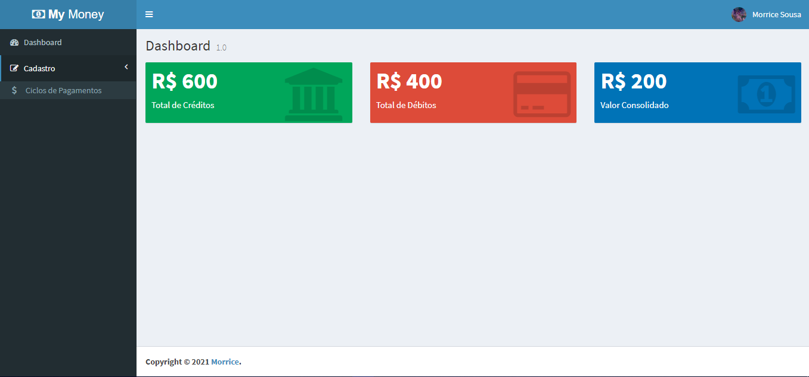

<h1 align="center">
 My Money
</h1>
<p align="center">

</p>

<br>

## 🧪 Tecnologias

Esse projeto foi desenvolvido com as seguintes tecnologias:

- [React](https://reactjs.org)
- [Redux](https://redux.js.org/)

## 🚀 Como executar

Clone o projeto e acesse a pasta do mesmo.

```bash
$ git clone https://github.com/morricedev/todo-frontend
$ cd todo-frontend
```

Para iniciá-lo, siga os passos abaixo:

```bash
# Instalar as dependências
$ npm i

# Iniciar o projeto
$ npm run dev
```

O app estará disponível no seu browser pelo endereço http://localhost:8080.

Lembrando que será necessário utilizar o backend disponobilizado neste [repositório](https://github.com/morricedev/mymoney-backend).

## 💻 Projeto

My Money é perfeito para que as pessoas possam organizar e gerenciar as suas finanças.

---

Feito com 💜 by Morrice
